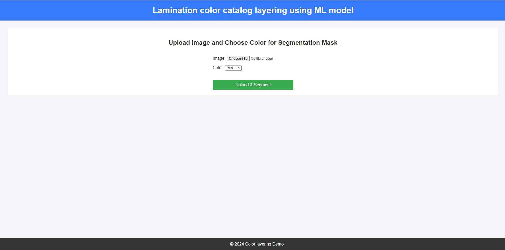

# 🛋️ Furniture Detection & Color Overlaying - Lamination Project  

## 📜 Overview  
This project focuses on **analyzing and optimizing lamination with an option for color overlaying**. It integrates **machine learning, data analysis, and visualization** techniques to provide an enhanced view of different furniture perspectives.  

## 🚀 Tech Stack  
- **Programming Language**: Python, HTML, css
- **Frameworks/Libraries**: PyTorch, Django, YOLO, Matplotlib  
- **Tools**: Jupyter Notebook, Git  

## 📂 Project Structure
```plaintext
lamination-project/
│
├── env/                   # Raw and processed data files
├── image_segmentation/    # Source code
│   ├── views.py           # Data preprocessing & visualize scripts
│   ├── model              # Machine learning model
├── README.md              # Project documentation
└── requirements.txt       # Python dependencies
```
💡 How to Use
```
git clone https://github.com/your-username/lamination-project.git
cd Furniture-detection-color-overlaing
```

```
virtualenv env
```
```
source env/scripts/activat
```

```
pip install -r requirements.txt
```

```
py manage.py runserver
```





