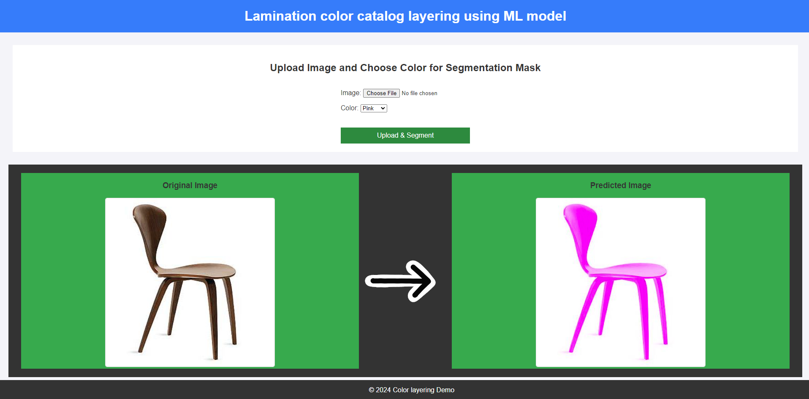
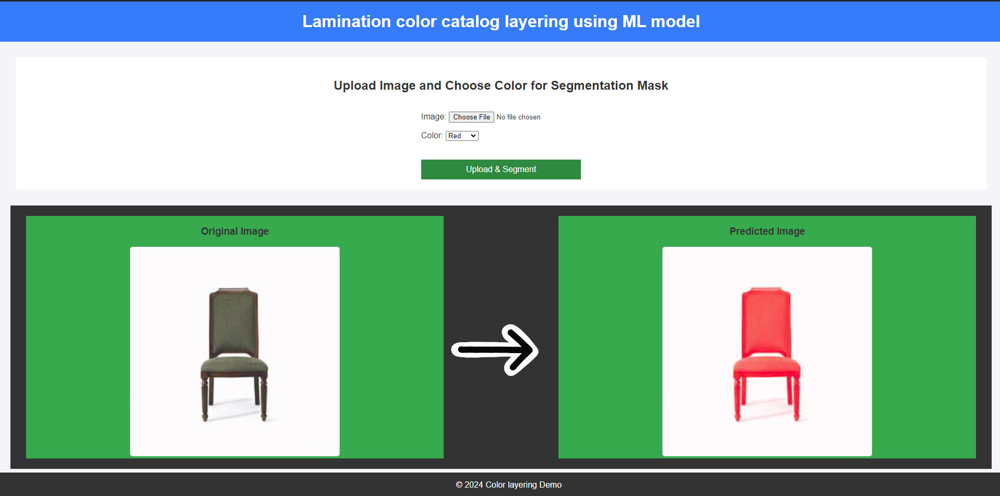

# Furniture-detection-color-overlaing

# Lamination Project

## 📜 Overview
This project focuses on "analyzing and optimizing the lamination process for industrial applications". It incorporates  machine learning, data analysis, etc. to achieve enhanced durability, cost efficiency].

## 🧩 Features
- Feature 1: e.g., Lamination process simulation
- Feature 3: Visualizations for lamination performance metrics
  
## 🚀 Tech Stack
- **Programming Language**: Python
- **Frameworks/Libraries**: pytorch, Django, Matplotlib, yolo
- **Tools**: Jupyter Notebook, Git

## 📂 Project Structure
```plaintext
lamination-project/
│
├── env/                   # Raw and processed data files
├── image_segmentation/    # Source code
│   ├── views.py           # Data preprocessing scripts
│   ├── model              # Machine learning model
│   └── visualize.py       # Visualization scripts
├── README.md              # Project documentation
└── requirements.txt       # Python dependencies

💡 How to Use
```git clone https://github.com/your-username/lamination-project.git
cd lamination-project
```
source env/scripts/activate

pip install -r requirements.txt

py manage.py runserver





